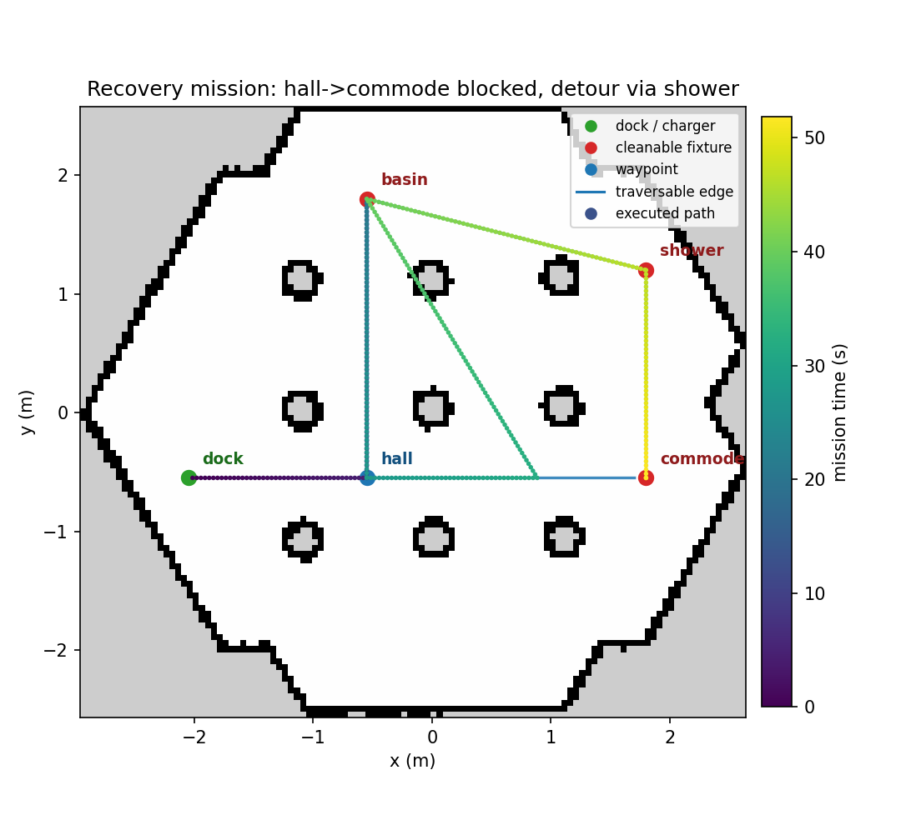
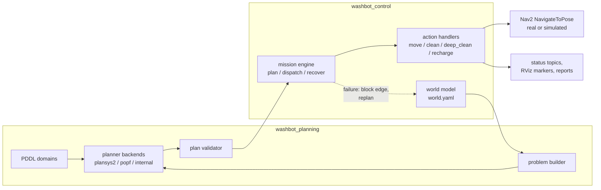
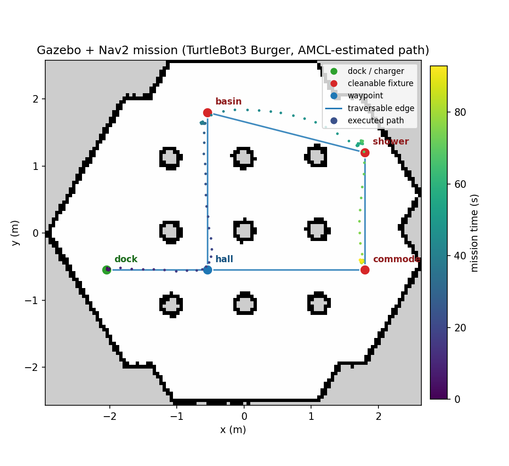
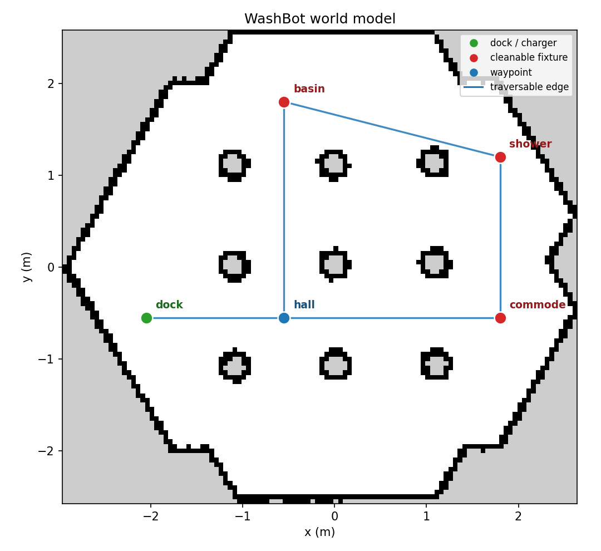
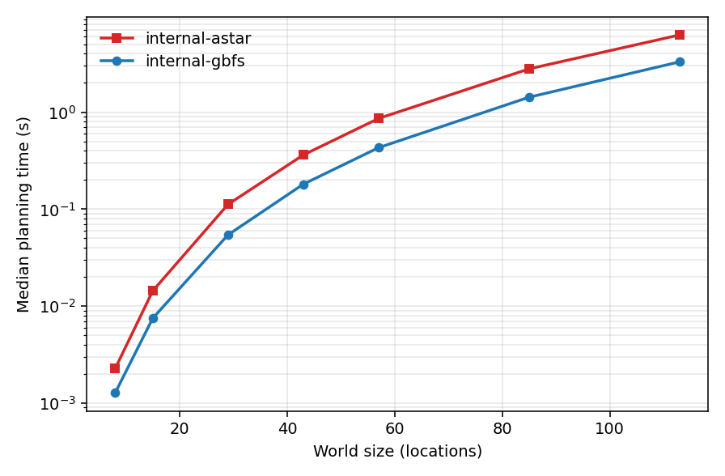

# WashBot — Task-Planned Cleaning Missions for TurtleBot3

> A ROS 2 robot that is told *what* to achieve — "clean every fixture in the washroom" —
> and works out *how* on its own: it plans with PDDL, executes with Nav2, watches every
> action, and **replans around failures at runtime**.


<p align="center">
  
</p>

The figure above is not a mock-up — it is the recorded trajectory of an actual mission run.
I injected a fault that blocks the `hall → commode` corridor; the robot cleaned the basin,
drove toward the commode, **failed mid-corridor** (the green segment that turns back),
blocked that passage in its world model, replanned, and finished the job through the
shower loop. No recovery behaviour is scripted anywhere — the detour falls out of
planning.

```
[mission_controller]: step 5/6: (move washbot hall commode)
[fake_nav2_server]:   injected failure for "hall->commode" (attempt 1, mode=abort)
[mission_controller]: plan (internal-astar, 4 steps):
[mission_controller]:     1. (move washbot hall basin)
[mission_controller]:     2. (move washbot basin shower)
[mission_controller]:     3. (move washbot shower commode)
[mission_controller]:     4. (clean washbot commode)
[mission_controller]: mission SUCCEEDED in 63.8s — cleaned: basin, commode (replans: 1, battery: 71%)
```

## Why I built this

This project started life as a small washroom-cleaning demo: a PDDL domain, a PlanSys2
planner call, and some glue scripts on a TurtleBot3. It worked, but everything
interesting — what happens when navigation fails, how the problem file stays in sync
with reality, how you test any of it without a robot — was missing.

I rebuilt it from the ground up around one idea: **the robot's knowledge of the world is
a first-class, mutable model, and every plan is disposable.** The executor never trusts
a plan further than the next action. When an action fails, the world model absorbs the
new fact ("that corridor is blocked"), a fresh PDDL problem is generated from the
current state, and the planner is asked again. Goal-directed behaviour, including all
recovery, emerges from that loop.

## Highlights

- **Deliberative autonomy** — missions are goals (`clean basin, commode`), not scripts.
  Visit order, routing, docking and recharging are all decided by a task planner.
- **Runtime replanning** — navigation failures block graph edges in the world model and
  trigger a replan from the robot's actual position; unreachable goals abort cleanly
  with a full report instead of hanging.
- **Three interchangeable planner backends** behind one interface: the PlanSys2
  planning service, a POPF subprocess, and a bundled A*/GBFS STRIPS planner I wrote so
  the whole system runs (and is CI-tested) on machines with no planner installed.
- **Two planning models** — a STRIPS domain for fast ordering decisions, and a PDDL 2.1
  temporal domain with action durations, battery drain and a recharge action.
- **Every plan is validated before execution** by replaying it through the domain
  semantics — a planner bug becomes a clean abort, not undefined robot behaviour.
- **Simulation-first testing** — a fake Nav2 action server (same interface as the real
  stack) with edge- and location-level fault injection, so the full
  plan → execute → fail → replan loop runs on any laptop in seconds.
- **Benchmarked and instrumented** — a problem generator scales worlds to hundreds of
  locations, a benchmark harness measures the backends, missions publish live status
  and RViz markers, and every run writes a JSON report.

## How it works



A mission ticks through a small set of honest contracts:

1. The **world model** (`world.yaml`) binds PDDL symbols to map poses and declares the
   traversable graph. It is mutated as the mission runs: fixtures get cleaned, edges
   get blocked, the battery drains.
2. The **problem builder** turns the current world state into a fresh PDDL problem —
   PDDL text is never edited by hand, so replanning is just "snapshot, rebuild, solve".
3. A **planner backend** returns a plan; the **validator** replays it symbolically
   before the robot moves a millimetre.
4. The **mission engine** (pure Python, no ROS) dispatches one step at a time and
   decides what a failure means: a failed `move` blocks the edge and replans, a failed
   `clean` is retried then aborts, replans are budgeted.
5. **Action handlers** map PDDL action names to robot behaviours — `move` speaks the
   Nav2 `NavigateToPose` action, `clean`/`deep_clean` run timed routines, `recharge`
   restores the battery. Adding a robot skill is: model it in PDDL, write a handler,
   register it.

The full design rationale is in [docs/architecture.md](docs/architecture.md).

## Quick start

### Plan without ROS (any machine)

The planning layer is pure Python — you can explore it before touching a robot:

```bash
cd washbot_planning
python3 -m washbot_planning.cli solve \
    --domain domain_strips.pddl --problem washroom_small.pddl \
    --backend internal-astar --validate
```

```
[internal-astar] plan with 6 steps (makespan 6.0):
0.000: (move washbot dock hall)  [1.000]
1.000: (move washbot hall basin)  [1.000]
2.000: (clean washbot basin)  [1.000]
3.000: (move washbot basin hall)  [1.000]
4.000: (move washbot hall commode)  [1.000]
5.000: (clean washbot commode)  [1.000]
validation: plan valid (6 steps)
```

### Run a full mission in simulation (ROS 2, no robot)

```bash
cd ~/ros2_ws/src && git clone https://github.com/Manas-arumalla/turtlebot3-plansys2.git
cd ~/ros2_ws && colcon build --symlink-install && source install/setup.bash

# Nominal mission: plan, navigate, clean everything
ros2 launch washbot_bringup mission_sim.launch.py

# Blocked corridor -> watch it replan a detour (the hero figure above)
ros2 launch washbot_bringup mission_sim.launch.py fail_edges:='[hall->commode]'

# Unreachable goal -> watch it exhaust routes and abort with a report
ros2 launch washbot_bringup mission_sim.launch.py fail_locations:='[commode]'
```

Add `use_rviz:=true` for live markers: red fixtures turn gold as they are cleaned, the
remaining route is drawn as a polyline, blocked passages show up in red.

### On a TurtleBot3 in Gazebo (real physics, real Nav2)

```bash
export TURTLEBOT3_MODEL=burger
ros2 launch turtlebot3_gazebo turtlebot3_world.launch.py     # terminal 1
ros2 launch washbot_bringup mission_tb3.launch.py            # terminal 2
```

One launch file brings up the full Nav2 stack on the washroom map, seeds AMCL with
the dock pose, and starts the mission. This is verified end to end — the figure
below is the AMCL-estimated path of a real Gazebo run: the 7-step plan executed in
**82.8 s** of simulated physics, DWB steering around the pillars that the task-level
graph abstracts away, zero replans, zero Nav2 recoveries.

<p align="center">
  
</p>

```
[mission_controller]: plan (internal-astar, 7 steps):
    1. (move washbot dock hall)      ...
[mission_controller]: mission SUCCEEDED in 82.8s — cleaned: basin, commode, shower (replans: 0, battery: 73%)
```

See [docs/getting_started.md](docs/getting_started.md) for the TurtleBot3 install
options, PlanSys2 integration (`planner_backend:=plansys2`) and the
temporal/battery mode.

## The world model

<p align="center">
  
</p>

One YAML file ([washbot_control/config/world.yaml](washbot_control/config/world.yaml))
defines the mission world on top of the SLAM map: waypoints, the traversable graph,
which fixtures are dirty, and how long each takes to clean. The loop through
`basin → shower → commode` is deliberate — it is what gives the planner a real routing
choice, and recovery a detour to find. This figure is generated from the actual map and
world file by `washbot_plan render-world`, so it never drifts from reality.

## Planning performance

Because plans are recomputed mid-mission, planning latency matters. The benchmark
harness generates facilities of increasing size (corridor spine, rooms, fixtures) and
measures each backend; every returned plan is also validated, so "solved" means
*correct*, not just "produced output".

<p align="center">
  
</p>

| World size | Locations | Goals | GBFS time | A* time | GBFS plan | A* plan |
|-----------:|----------:|------:|----------:|--------:|----------:|--------:|
| 2 rooms    | 8         | 4     | 1.3 ms    | 2.3 ms  | 17 steps  | 15 steps |
| 8 rooms    | 29        | 16    | 54 ms     | 112 ms  | 101 steps | 73 steps |
| 16 rooms   | 57        | 32    | 0.43 s    | 0.86 s  | 257 steps | 165 steps |
| 32 rooms   | 113       | 64    | 3.3 s     | 6.3 s   | 713 steps | 397 steps |

The two internal strategies trade plan quality for speed exactly as theory predicts —
GBFS is ~2× faster, A* (with the same inadmissible h-add heuristic) produces plans
~45% shorter at scale. For the washroom-scale worlds the robot actually runs in,
either replans in **well under 10 ms**. Full methodology, environment and data:
[docs/benchmarks.md](docs/benchmarks.md) and [benchmarks/results/](benchmarks/results/).

Reproduce with:

```bash
python3 -m washbot_planning.cli benchmark --rooms 2,4,8,12,16,24,32 --repeats 3 \
    --out benchmarks/results/results.csv
python3 -m washbot_planning.cli plot-benchmark --csv benchmarks/results/results.csv \
    --out-dir docs/media
```

## Repository layout

```
turtlebot3-plansys2/
├── washbot_planning/          # Planning layer (pure Python core, zero ROS deps)
│   ├── washbot_planning/
│   │   ├── pddl_core/         #   PDDL parser, grounder, A*/GBFS search, validator
│   │   ├── backends.py        #   plansys2 / popf / internal behind one interface
│   │   ├── problem_builder.py #   world snapshot -> PDDL problem text
│   │   ├── generator.py       #   scalable synthetic facilities for benchmarks
│   │   ├── benchmark/         #   benchmark runner + plots
│   │   └── cli.py             #   washbot_plan: solve / validate / benchmark / render
│   └── pddl/                  #   STRIPS + temporal domains, example problems
├── washbot_control/           # Execution layer
│   ├── washbot_control/
│   │   ├── world_model.py     #   mutable world state, snapshots for the planner
│   │   ├── engine.py          #   plan/dispatch/recover state machine (ROS-free)
│   │   ├── mission_controller.py  # the ROS 2 node wiring it all together
│   │   ├── handlers/          #   move -> Nav2, clean/deep_clean, recharge
│   │   └── sim/               #   fake Nav2 server + fault injection, pose tools
│   └── config/world.yaml      #   waypoints, edges, dirt state, durations
├── washbot_bringup/           # Launch files, Nav2 config, maps, RViz profiles
├── docs/                      # Architecture, PDDL modelling, benchmarks, guides
└── benchmarks/                # Benchmark data (CSV) and how to regenerate it
```

## Testing

Forty-nine unit tests cover the parser, grounder, search, validator, problem builder,
generator, world model — and, most importantly, the **entire recovery matrix** of the
mission engine (blocked passages, retry budgets, replan limits, unreachable goals),
which runs against the real planner with simulated step outcomes. The planning core and
the engine are deliberately ROS-free, so the interesting logic is tested in
milliseconds, on any machine, in CI:

```bash
python3 -m pytest washbot_planning/test washbot_control/test
python3 -m flake8 washbot_planning washbot_control washbot_bringup
```

The [CI workflow](.github/workflows/ci.yml) runs lint + the core suite on plain
Ubuntu, and a full `colcon build && colcon test` inside a ROS 2 Jazzy container.

## Documentation

| Document | What it covers |
|---|---|
| [docs/architecture.md](docs/architecture.md) | Components, contracts, failure policy, design trade-offs |
| [docs/getting_started.md](docs/getting_started.md) | Install, simulation scenarios, TurtleBot3, PlanSys2, temporal mode |
| [docs/pddl_modeling.md](docs/pddl_modeling.md) | Both domains line by line, and why they are shaped that way |
| [docs/benchmarks.md](docs/benchmarks.md) | Methodology, environment, full results, discussion |
| [docs/extending.md](docs/extending.md) | Add a waypoint, a robot skill, or a planner backend |
| [docs/troubleshooting.md](docs/troubleshooting.md) | The failure modes I actually hit, and their fixes |

## Roadmap

- Execute genuinely concurrent temporal plans (the executor currently serializes by
  start time — fine for one robot, wrong for a fleet).
- Multi-robot missions: the domains are already multi-robot-ready (`?r - robot`);
  the executor is not.
- Perception-driven dirt detection instead of declared dirt state.
- Integration with the full PlanSys2 executor (behavior-tree action nodes) as an
  alternative executive.

## Acknowledgements

- [PlanSys2](https://plansys2.github.io/) — the ROS 2 planning system this project
  integrates with, and whose architecture shaped my thinking about planner/executor
  separation.
- [Nav2](https://docs.nav2.org/) and [TurtleBot3](https://emanual.robotis.com/docs/en/platform/turtlebot3/overview/)
  — navigation stack and robot platform.
- The PlanSys2 hospital exercises from the [Docencia-fmrico](https://github.com/Docencia-fmrico)
  teaching organization, which I studied while designing the mission structure here.
- POPF (Coles et al.) — the temporal planner used for the durative domain.

## License

[Apache 2.0](LICENSE)
