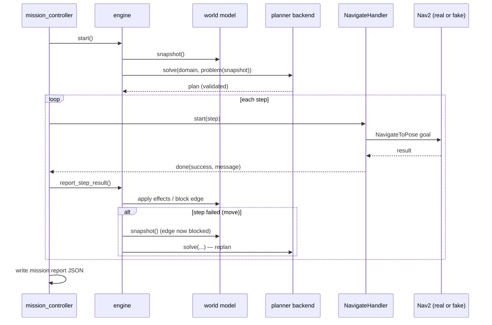

# Architecture

This page explains how the system is put together and, more importantly, why it is
shaped the way it is. The short version: **planning is a service, the world model is
the single source of truth, and the executor treats every plan as disposable.**

## The layering rule

The repository is three packages with a strict dependency direction:

```
washbot_bringup  ──▶  washbot_control  ──▶  washbot_planning
(launch, config)      (execution, ROS)      (planning, pure Python)
```

Two internal rules keep the interesting logic testable:

1. **`washbot_planning` has no ROS dependency at all.** The parser, grounder, search,
   validator, problem builder, generator and benchmark harness run on any Python 3
   machine. The only ROS-aware file is the optional `planner_client` node.
2. **Inside `washbot_control`, decisions and I/O are separated.** The mission engine
   (`engine.py`) and world model (`world_model.py`) are plain Python — no rclpy import
   anywhere. The ROS node (`mission_controller.py`) only dispatches, times out, and
   publishes. This is why the whole recovery matrix has unit tests that run in
   milliseconds.

## Components

### World model (`washbot_control/world_model.py`)

The robot's knowledge, loaded from `config/world.yaml`:

- **Locations** — PDDL symbols bound to metric poses (`x, y, yaw`), with per-fixture
  cleaning metadata (`dirty`, `deep_dirty`, `clean_duration`).
- **Edges** — the traversable graph, stored directed (each YAML entry expands to both
  directions). Directed storage is deliberate: a navigation failure blocks a passage,
  and I want the option of one-way blocking.
- **Mission state** — robot location, cleaned set, blocked edges, battery percentage.

Its one job beyond bookkeeping is `snapshot()`: producing an immutable
`WorldSnapshot` that the problem builder turns into PDDL. Anything the robot learns
must land in the world model, or it does not exist as far as planning is concerned.

### Problem builder (`washbot_planning/problem_builder.py`)

Generates problem PDDL from a snapshot plus a goal list. Nothing in the system ever
edits PDDL text incrementally — every plan and replan is generated from scratch. This
sounds wasteful and is anything but: problems at this scale generate in microseconds,
and it eliminates the entire class of "problem file drifted from reality" bugs.

### Planner backends (`washbot_planning/backends.py`)

One interface, three implementations, all returning the same `PlanningResult`:

| Backend | What it is | When it is used |
|---|---|---|
| `plansys2` | The PlanSys2 `planner/get_plan` service | When a PlanSys2 stack is running |
| `popf` | POPF as a subprocess | Temporal domain; installed with PlanSys2 |
| `internal-gbfs` / `internal-astar` | Bundled STRIPS search (h-add heuristic) | Development, CI, machines with nothing installed |

`auto` resolution prefers POPF and falls back to the internal search, so a fresh
checkout plans out of the box. The internal planner exists because I refuse to have
the test suite and benchmarks depend on an apt package; it intentionally **rejects**
what it cannot handle (durative actions, numeric fluents) with an error pointing at
the capable backends, rather than mis-planning.

### Plan validation (`washbot_planning/pddl_core/validator.py`)

Every plan — from any backend — is replayed against the domain semantics before
execution: preconditions checked step by step, effects applied, goal checked at the
end. The cost is microseconds; the payoff is that a planner bug or a
domain-modelling mistake surfaces as `mission ABORTED: planner returned an invalid
plan` instead of a robot doing something undefined. The same validator keeps the PDDL
files honest in the test suite and audits every benchmark run.

### Mission engine (`washbot_control/engine.py`)

A small state machine (`IDLE → PLANNING → EXECUTING → SUCCEEDED | ABORTED`) that owns
every decision:

| Event | Policy |
|---|---|
| `move` fails | Block the traversed edge in the world model, replan from the robot's current location |
| `clean` fails | Retry in place (`max_step_retries`), then abort — a broken actuator cannot be planned around |
| Plan exhausted, goals unmet | Replan (defensive; cannot happen with a validated plan) |
| Planner finds no plan | Abort with the planner's reason (e.g. goal unreachable) |
| Replan budget (`max_replans`) exceeded | Abort |
| Goals already satisfied | Succeed without dispatching anything |

Effects are applied to the world model only when a step *reports success* — the world
model tracks reality, not intention. Every event is recorded and lands in the
end-of-mission JSON report.

### Action handlers (`washbot_control/handlers/`)

The bridge from PDDL symbols to robot behaviour. A handler implements two methods
(`start(step, done_cb)`, `cancel()`) and is registered under the PDDL action name:

- `move` → `NavigateHandler`: Nav2 `NavigateToPose` action client. Asynchronous all
  the way down — it never blocks the executor, polls for the server with a timer, and
  distinguishes rejection, abortion and cancellation in its failure messages.
- `clean` / `deep_clean` → `CleanHandler`: timed routine with progress publishing,
  optional slow spin (reads nicely in RViz/Gazebo), battery drain.
- `recharge` → `RechargeHandler`: timed dock charge, restores battery.

The mission controller guarantees a single in-flight step and arms a watchdog around
each one; on timeout the handler is cancelled and the failure goes through the normal
recovery policy. A cancelled handler drops its callback first, so a late Nav2 result
can never be mis-attributed to the next step.

### Simulation tools (`washbot_control/sim/`)

`fake_nav2_server` exposes the *real* `NavigateToPose` interface — the mission
controller cannot tell it from Nav2. It simulates constant-velocity motion with live
feedback and, crucially, injects faults:

- `fail_edges:='[hall->commode]'` — a specific passage is blocked (origin matched by
  the robot's current position, destination by the goal pose). The mission should
  detour.
- `fail_locations:='[commode]'` — every approach to a waypoint fails. The mission
  should exhaust routes and abort cleanly.
- `fail_mode` (`abort` mid-drive vs `reject` at goal submission) and `fail_times`
  (fail N times, then succeed; `-1` = always) select the failure flavour.

`pose_recorder` writes any `PoseStamped` topic to CSV; the executed-trajectory figures
in the README come from it via `washbot_plan render-world --path-csv`.

## A mission, end to end



## Design trade-offs I made deliberately

**A lightweight executive instead of the PlanSys2 executor.** PlanSys2 ships a full
executor that dispatches plan actions to behavior-tree action nodes. I use PlanSys2 as
a *planning service* and run my own execution loop instead, because I wanted (a) the
recovery policy to be explicit, inspectable Python rather than distributed BT
semantics, (b) the whole loop to run without any planning infrastructure installed,
and (c) the engine to be unit-testable off-robot. The cost is real: no concurrent
action dispatch, no BT-level recovery nodes. For a single robot doing sequential work
that trade is right; the roadmap keeps a full PlanSys2-executor integration as an
alternative executive.

**Temporal plans execute serially.** The temporal domain gives the planner durations
and battery constraints, and POPF may return overlapping actions. The executor
dispatches them in start-time order, one at a time. With one robot every returned plan
is effectively sequential anyway (a robot cannot move and clean simultaneously in this
domain), so serialization is sound here — but it would be wrong for multi-robot plans,
which is why multi-robot is on the roadmap rather than in the feature list.

**Failures block edges, not goals.** Mapping "navigation failed" to "this passage is
untraversable" is a modelling choice. It is conservative (the failure might have been
transient) but it converges: each failure removes one edge, so the planner either
finds another route or proves the goal unreachable. Transient-failure tolerance comes
from `fail_times`-style retries at the Nav2 level (Nav2 itself retries and recovers
before aborting) rather than optimistic re-tries of the same edge.

**The world model is trusted.** Poses come from `world.yaml`, not from perception.
That is the honest boundary of this project: it is a *task-planning and execution*
system. The waypoints were verified against the map programmatically (every pose and
every edge sampled for free space), but discovering dirt or new obstacles is
perception work, listed on the roadmap.

## Interfaces reference

**Topics published by `mission_controller`:**

| Topic | Type | Content |
|---|---|---|
| `/washbot/mission_status` | `std_msgs/String` (JSON) | state, goals, cleaned, robot_at, battery, replans, blocked edges |
| `/washbot/battery` | `std_msgs/Float32` | battery percentage |
| `/washbot/world_markers` | `visualization_msgs/MarkerArray` | live world graph + planned route for RViz |
| `/washbot/cleaning_progress` | `std_msgs/String` (JSON) | per-fixture cleaning progress |
| `cmd_vel` | `geometry_msgs/Twist` | slow spin during simulated cleaning |

**Subscribed:** `/washbot/mission_command` (`std_msgs/String`): `start`, `abort`.

**Key parameters** (`mission_controller`): `world_file`, `goals` (list or `[all]`),
`domain_mode` (`strips`/`temporal`), `planner_backend`
(`auto`/`internal-gbfs`/`internal-astar`/`popf`/`plansys2`), `max_replans`,
`max_step_retries`, `action_timeout`, `autostart`, `report_dir`.

**Mission reports** land in `~/.washbot/reports/mission_<stamp>.json` with the full
event history and per-step wall-clock timings —
[docs/examples/mission_report_recovery.json](examples/mission_report_recovery.json) is
a real one from the recovery scenario.
