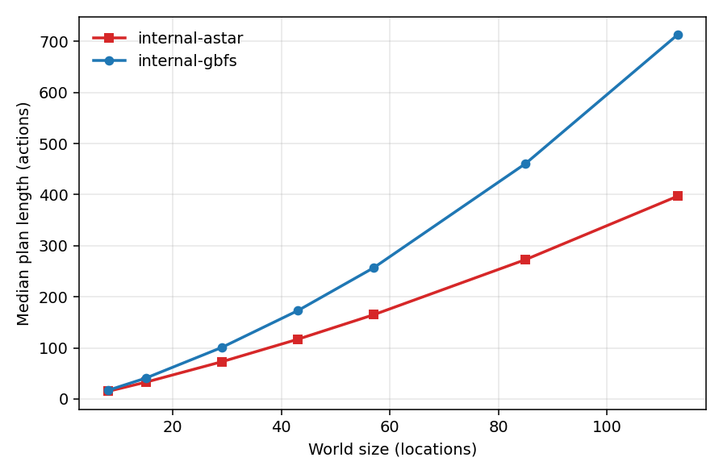
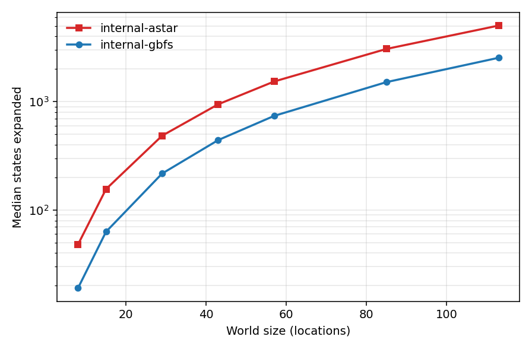

# Planning Benchmarks

Planning latency matters here in a specific way: plans are recomputed *mid-mission*
after failures, so a slow planner is not a startup cost — it is a robot standing
still. These benchmarks answer two questions:

1. How far do the bundled search strategies scale before latency hurts?
2. What do you pay in plan quality for greedy speed?

## Methodology

- Worlds are generated by `washbot_planning.generator`: a corridor spine with 2 rooms
  per corridor segment, 2 dirty fixtures per room, seeded travel/clean times
  (seed 7 throughout — runs are reproducible).
- The goal is always "clean every fixture", so goals scale linearly with rooms.
- Each (backend, size) pair runs 3 times; tables report medians.
- **Every returned plan is replayed through the validator.** A row counts as solved
  only if the plan is provably correct against the domain semantics.
- Timeout 60 s per attempt.

Reproduce everything with:

```bash
python3 -m washbot_planning.cli benchmark --rooms 2,4,8,12,16,24,32 --repeats 3 \
    --out benchmarks/results/results.csv
python3 -m washbot_planning.cli plot-benchmark --csv benchmarks/results/results.csv \
    --out-dir docs/media
```

## Environment

The committed results ([benchmarks/results/results.csv](../benchmarks/results/results.csv))
were produced on my development machine:

| | |
|---|---|
| CPU | AMD Ryzen 9 8940HX |
| RAM | 14 GiB |
| Python | 3.12.3 |
| Backends | `internal-gbfs`, `internal-astar` (bundled search, h-add heuristic) |

POPF is not installed on this machine, so the committed CSV covers the internal
backends; the harness picks up `popf` automatically wherever it is present (any
machine with PlanSys2 installed) — rerun the commands above there to extend the
comparison.

## Results

All 42 runs solved, and all 42 plans validated.

| Rooms | Locations | Goals | Backend | Median time | Median plan | States expanded |
|------:|----------:|------:|---------|------------:|------------:|----------------:|
| 2  | 8   | 4  | gbfs  | 1.3 ms | 17  | 19   |
| 2  | 8   | 4  | astar | 2.3 ms | 15  | 48   |
| 4  | 15  | 8  | gbfs  | 7.5 ms | 41  | 63   |
| 4  | 15  | 8  | astar | 14 ms  | 33  | 156  |
| 8  | 29  | 16 | gbfs  | 54 ms  | 101 | 217  |
| 8  | 29  | 16 | astar | 112 ms | 73  | 485  |
| 12 | 43  | 24 | gbfs  | 181 ms | 173 | 442  |
| 12 | 43  | 24 | astar | 362 ms | 117 | 946  |
| 16 | 57  | 32 | gbfs  | 430 ms | 257 | 740  |
| 16 | 57  | 32 | astar | 861 ms | 165 | 1537 |
| 24 | 85  | 48 | gbfs  | 1.43 s | 461 | 1515 |
| 24 | 85  | 48 | astar | 2.79 s | 273 | 3067 |
| 32 | 113 | 64 | gbfs  | 3.30 s | 713 | 2541 |
| 32 | 113 | 64 | astar | 6.25 s | 397 | 5039 |





## Reading the numbers

**At mission scale, planning is free.** The worlds the robot actually runs
(5–15 locations) plan in **1–15 ms** with either strategy. A replan after a blocked
corridor costs less than one control cycle of the Nav2 local planner.

**GBFS buys ~2× speed with a real quality bill.** Both strategies use the same
inadmissible h-add heuristic; the difference is pure search discipline. At 32 rooms,
GBFS returns 713-step plans against A*'s 397 — an 80% longer tour, which on a real
robot is minutes of wasted driving. The mechanism is visible in the corridor-spine
worlds: h-add has no notion of travel economy, so GBFS hares toward whichever goal
looks cheapest *now*, leaves rooms half-finished, and pays the corridor crossings
again later. A*'s g-cost term is what keeps tours coherent.

**Practical default.** `internal-astar` until planning latency approaches ~1 s
(≈ 60 locations here), `internal-gbfs` beyond that, POPF wherever it is installed —
which is what `planner_backend: auto` does, minus the strategy switch: it prefers
POPF, then falls back to GBFS for robustness on huge inputs.

**Why node counts are low but time grows fast.** The h-add heuristic is recomputed
per generated state with a Dijkstra-style sweep over the relaxed task, so per-node
cost grows with world size. That is the right trade at this scale — expansions stay
in the low thousands — but it is the first thing to optimize (incremental h-add, or
landmark counting) if this ever needed to plan 500-location facilities.

**What these benchmarks do not claim.** They compare two configurations of my own
search against each other, on one adversarial-but-synthetic world family, on one
machine. They are not a planner bake-off; POPF (or any modern planner) has decades of
engineering behind it, which is exactly why it is the preferred backend when present.

## Mission-level timings

From real end-to-end runs (logs in [docs/examples/](examples/)); the first three
use the simulated Nav2 server at 0.35 m/s, the last is full Gazebo physics with
the real Nav2 stack on a TurtleBot3 Burger:

| Scenario | Outcome | Wall time | Replans |
|---|---|---:|---:|
| Nominal (basin + commode) | SUCCEEDED | 46.5 s | 0 |
| Blocked corridor `hall->commode` | SUCCEEDED (detour via shower) | 63.8 s | 1 |
| Commode unreachable from everywhere | ABORTED (`goal unreachable`) | 49.6 s | 2 |
| Gazebo + Nav2, all three fixtures | SUCCEEDED (7-step A* tour) | 82.8 s | 0 |

The abort case is a feature, not a failure: the engine blocked both approaches after
genuine attempts, asked the planner, received a proof of unreachability from the
relaxed-reachability check, and shut the mission down with a full report — in under a
minute, with no human intervention and no infinite retry loop.
